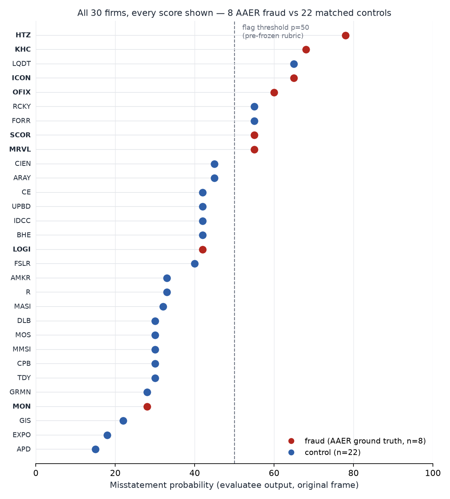

# Issue #0 — Can an LLM detect accounting fraud from public financial data before public revelation?

> **DRAFT — not published. Owner sign-off required (RP-10 final gate).**
> Scoring: Claude-assisted, human-finalized. All grading and selection criteria
> were committed before the corresponding results existed; commit hashes below
> are the reader's verification path. This result is specific to a single
> Claude-based pipeline (evaluatee: claude-sonnet-5, pinned).

## 1. The question, and the honest answer

**Question.** Given only pre-revelation public financial data (point-in-time
XBRL series and filing chronology), can an LLM distinguish companies later
charged with accounting fraud (SEC AAER ground truth) from matched clean
controls?

**Answer (per pre-committed conclusion rule R3, which fired).** The separation
is real and statistically strong — but **a substantial part of what the score
measures on known fraud cases is memory of the company, not analysis of the
numbers**. On 8 fraud vs 22 matched controls, fraud firms score far higher
(permutation p = 0.0011; every score shown in §3). Yet when we re-scored each
fraud case with identity masked and all monetary values rescaled, 5 of 8 fraud
cases moved by more than half of their original separation contribution — our
pre-registered threshold for a memorization-dominated result. We committed
rule R3 ("if identity-perturbation deltas dominate base scores for the
majority of fraud cases, the headline must foreground memorization") **before
any control score existed** (commit `5f4ca65`). It fired. So the headline is:

> **An LLM separates known frauds from controls on this case set — but the
> score is entangled with what the model remembers about each company.
> Identity-blinded scoring still separates (p = 0.0021, AUC 0.86), while
> name-recognition probes show the blinding itself is imperfect. The capability
> question remains open pending the post-training-cutoff holdout test, where
> memorization is structurally impossible.**

## 2. Method (verification path: read the commits, not our claims)

- **Cases**: 8 fraud firms with SEC AAER ground truth (Monsanto, Orthofix,
  Logitech, Hertz, Iconix, Marvell, comScore, Kraft Heinz) vs **22 matched
  controls** (2–3 per fraud case; matched on size → industry → fiscal era by a
  pure selection function over an exhaustively enumerated SIC pool).
  Control criteria committed before selection ran: `b22e84e` (+ disclosed
  amendments `1384a39`, `5f4ca65` — including removal of Analog Devices after
  confirming its 2008 §10(b)/Rule 10b-5 options-backdating order, SEC Admin.
  Proc. 3-13050, Rel. 33-8923; a 10b-5 respondent cannot serve as a clean
  control).
- **Look-ahead control**: every payload fact carries the `filed` date of the
  submission that reported it; a coded filter admits only `filed ≤ cutoff`,
  where cutoff = the fraud's first public revelation date (controls inherit
  their matched case's cutoff). Verified per-payload before launch
  (`tools/prelaunch_check_rp10.py`, 22/22 PASS).
- **Blindness**: the evaluatee receives only whitelisted case-input fields +
  numeric series + filing-form chronology. No labels, no group membership, no
  enforcement references; canary strings and answer-key vocabulary are guarded
  at call time.
- **Pre-commitments**: analysis plan with conclusion rules R1–R4 and all test
  choices (permutation test, Fisher threshold p ≥ 50 reused from the frozen
  grading rubric, FPR reporting rules, effect sizes) committed at `5f4ca65`,
  before any control score existed. Statistics seed-fixed (20260707);
  reproduce with `make analysis`.
- **Evaluatee**: claude-sonnet-5 (pinned; serving model verified per call,
  0 pin mismatches, 0 incomplete cases). Grader: claude-fable-5, with human
  finalization of all grades (frozen at `f3b76f7`).

## 3. Results — every data point, then the statistics

| statistic (primary frame: identity-visible, 8 vs 22) | value |
|---|---|
| mean score difference (fraud − control) | **+19.8pp** (56.4 vs 36.5) |
| permutation test, 100k perms, one-sided | **p = 0.0011** |
| Fisher exact at pre-frozen flag threshold p ≥ 50 | p = 0.0031 (flags: 6/8 fraud, 3/22 control) |
| Cliff's δ (≡ rank-biserial) | 0.648 |
| AUC (bootstrap 95% CI, 10k) | 0.824 [0.599, 0.983] — **unstable at N = 30; the dot plot above is the primary visual** |
| false-positive rate | 3/22 observed ≈ 13.6%; **Clopper–Pearson 95% CI [2.9%, 34.9%]** (never "0%": with 0 FP we would report the rule-of-three bound 13.6%) |
| identity-blinded frame (perturbed fraud vs controls) | p = 0.0021 · AUC 0.864 [0.722, 0.969] · flags 4/8 fraud |

**Mechanical baselines on the same 30 firms, same point-in-time data** (this
is the credibility core — an LLM that merely re-derives Beneish would be
uninteresting):

| screen | own separation | flags (fraud / control) | Spearman ρ vs LLM | LLM residual separation |
|---|---|---|---|---|
| Beneish M-Score (computable 22/30) | p = 0.498, AUC 0.510 | M > −1.78: 1/6 vs 0/16 · M > −2.22: 2/6 vs 0/16 | **−0.075** | p = 0.0053 |
| Dechow F-Score (computable 22/30) | p = 0.268, AUC 0.573 | F > 1: 2/6 vs 3/16 | **−0.144** | p = 0.0010 |

The LLM's ranking is essentially uncorrelated with both mechanical screens,
and its separation survives after regressing either screen out (pre-committed
rule R2 did **not** fire). Per-firm uncomputable inputs are listed in
`baseline_details.json` — nothing was imputed.

## 4. The memorization finding (why R3 is the headline)

Each fraud case was scored k=5 times in both variants (identity visible /
identity masked + all money values rescaled by a case-fixed factor). The
scatter shows the identity-perturbation delta against the base score, with
±2·SE noise bands from the redraws:

- **Hertz −30.2pp**: the largest delta belongs to the case whose accounting
  scandal is most prominently represented in public text — removing the name
  removed a third of the score. Memorized guilt.
- **Monsanto +15.8pp**: the one company never identified in any recognition
  probe *gained* 16pp when anonymized. In the identity-visible run the model
  cited the incriminating margin compression and then discounted it as
  "plausibly explained by well-known glyphosate/Roundup pricing pressure
  rather than misstatement" — a famous-name innocence prior, in the model's
  own words (`runs/main/case_06.json`).
- 5/8 cases crossed the pre-registered R3 threshold (delta ≥ half the case's
  separation contribution).

**Why masking alone was never going to be enough**: Sarkar & Vafa show company
identity is reconstructable from censored filing text in ~70% of cases. Our
name-prediction probe confirms the numeric analogue: asked "which company is
this?" on the anonymized, rescaled payloads, the evaluatee named the correct
company in **15/30 firms (50%) in a single uniform draw — 12/22 controls
(54.5%)** — an order of magnitude above the <5% identifiability EDINET-Bench
reports for tabular data — and 6/8 fraud cases across probe draws (Monsanto:
never, in three draws). This is why the design stacks a coded temporal cutoff
+ value perturbation + recognition probes rather than trusting anonymization,
and why the recognition result is itself a reported finding, not a footnote.
One nuance the probes add: recognition alone does not move control scores
(median recognized vs unrecognized controls differ by +3pp, below our
pre-registered 10pp bar) — the deltas on fraud cases track memorized *scandal
knowledge*, not mere familiarity.

## 5. Error analysis (misses analyzed as carefully as hits)

Full per-case taxonomy with filing citations: `analysis/error_analysis.md`.

- **Missed frauds (2)**: Monsanto — evidence present, reasoning overridden by
  the identity prior (see §4); the decisive rebate accrual is also invisible
  in XBRL aggregates (tag-resolution limit). Logitech — the model *wrote down
  the true mechanism* (delayed inventory write-down) as its third-ranked
  hypothesis and still scored 42: a ranking/confidence failure, not a
  perception failure.
- **Correct flags with wrong mechanism (3 of 6 hits)**: Hertz, Kraft Heinz,
  Marvell were flagged at the right time for the wrong reason (d2 = 0). High
  score ≠ right analysis; we grade both axes.
- **False positives (3)**: Liquidity Services (lawful impairment trajectory
  read as misstatement risk), Rocky Brands (seasonal inventory build), and
  Forrester — flagged on 2006 option-era amendments that sit *outside* the
  ±5-year clean-label window our control criteria enforce: a label-window
  mismatch, plus the same "10-Q/A cluster ⇒ backdating" template the model
  also misapplied to Marvell. In all three, the cited numbers are real; the
  failure is the inference step.
- **Fraud-type coverage**: revenue recognition 4/4 detected, reserves 1/1,
  inventory 0/1, cost/rebate schemes 1/2 — against an AAER population that is
  ~43% revenue recognition, 24% reserves, 11% inventory, 11% loan impairment
  (Anti-Fraud Collaboration, 531 AAERs 2014–2019). Loan impairment is absent
  from our sample by design (no financials).
- **Earliness**: for detections with at least the right account area (3), the
  decisive evidence sat in filings 1–4 quarters before public revelation.
  Context: enforcement databases lag initial revelation by 150–1,017 days on
  average (Karpoff, Koester, Lee & Martin), so AAER-anchored studies measure
  late signals; a systematic score-over-time design is specified (not run) in
  `docs/EARLINESS_DESIGN.md`.
- **Calibration**: ECE (10-bin) = 0.209 against a 26.7% base rate; confidence
  (distance from the flag threshold) predicts correctness only weakly
  (AUROC 0.656). Reported as a finding: these probabilities are rankings, not
  calibrated risk estimates.

## 6. Positioning against the literature (read the caveats)

Not benchmark-comparable — different N, task framing, and base rates; listed
for orientation only. Bao et al. (2020, JAR) RUSBoost: out-of-sample AUC 0.725
with precision 4.48% / recall 4.88% at a realistic base rate. EDINET-Bench
(2025): LLM ROC-AUC ≈ 0.73 vs logistic 0.68 on Japanese filings.
AuditFraudBench (2026): best model 0.522 accuracy on AAER-grounded pattern
tasks. Kim, Muhn & Nikolaev's widely-cited GPT-4 60.35% figure was an
earnings-*direction* task, not fraud detection, and the paper was withdrawn in
February 2025 — cite accordingly. Our numbers come from a curated 8-vs-22 case
set with AAER-conditioned selection; **we make no benchmark-comparable
accuracy/AUC claim** (pre-committed rule R4's framing constraint).

## 7. Limitations (all of them)

1. **N = 8 fraud cases.** Nothing here estimates population-level detection.
2. **AAER selection bias**: our frauds are the caught frauds — detected,
   litigated, XBRL-era, large enough to matter.
3. **Partial observability**: Dyck, Morse & Zingales estimate ~10% of large
   firms engage in securities fraud yearly with only ~⅓ detected. Our control
   group almost certainly contains undetected frauds; that biases measured
   specificity **down**, making the false-positive result conservative where
   the true label is "undetected fraud". (Case in point: Analog Devices was
   removed only because its non-AAER 10b-5 order was independently confirmed.)
4. **XBRL-era restriction**: pre-2009 schemes and narrative-only evidence
   (footnotes, MD&A text) are outside the input space; the Monsanto miss is
   partly this limit.
5. **Single-model dependency**: one evaluatee (claude-sonnet-5), one pipeline;
   the grading is Claude-assisted with human finalization. No cross-model
   check has run yet.
6. **Prompt sensitivity**: one frozen prompt/schema; k=5 redraws bound
   sampling noise (per-case σ up to 12pp) but not prompt variation.
7. **Base-rate translation**: at ~0.7% real-world fraud prevalence, even the
   optimistic corner of our AUC interval yields low PPV in forward screening —
   **backtest detection is not screening value**. Any screening use would need
   the forward watchlist design below.

## 8. Future work (described, not executed)

- **The clean test**: post-training-cutoff holdout — frauds first revealed
  after the evaluatee's January 2026 knowledge cutoff, where memorization is
  structurally impossible. Candidate list and monthly re-scan procedure:
  `docs/FUTURE_HOLDOUT_CANDIDATES.md` (Tier 2 — post-release revelations — is
  empty as of 2026-07-07 and fills with time).
- Frozen-pipeline forward watchlist with timestamped, falsifiable predictions.
- Cross-model disagreement check; earliness trajectories per
  `docs/EARLINESS_DESIGN.md`.

## 9. Framing and disclaimers

Every case discussion above is an **opinion** based solely on cited public
filings and SEC documents (AAER/order numbers and filing accessions cited
in-line and in the linked analyses; the basis of every opinion is disclosed —
Omnicare logic). Fraud-case descriptions restate SEC findings, not our
allegations; control-firm discussions describe lawful accounting and expressly
do not imply misconduct. We hold no positions in any company named, sell
nothing, and used no non-public information. Educational and informational
purposes only; nothing here is investment, legal, or accounting advice.
